# Synology DS1513+ migration to Lenovo Thinkcentre with Ubuntu Server

**NOTE:** _WHEN WRITING THIS GUIDE, IT WAS BASED ON_
- _UBUNTU SERVER v23.1_
- _DOCKER ENGINE v24.0.7, build afdd53b_
- _DOCKER-COMPOSE v2.24.0_


# YOU WILL ONLY NEED A MONITOR AND A KEYBOARD FOR THE FIRST FEW STEPS, THEN THOSE WILL BE REPLACED BY A LAPTOP


# Table of Contents

1. <a href="#downloading-and-installing-ubuntu-server">Downloading and Installing Ubuntu Server</a>
2. <a href="#fix-grub-to-have-the-dual-boot">Fix GRUB to have the dual boot</a>
3. <a href="#setting-up-internet-connection">Setting up internet connection</a>
4. <a href="#headless-operation">Headless operation</a>
5. <a href="#installing-docker-and-docker-compose">Installing docker and docker-compose</a>
6. <a href="#mounting-folders-on-synology-mini-pc-and-laptop">Mounting folders on Synology Mini-PC and Laptop</a>
7. <a href="#copying-configuaration-files-from-synology">Copying configuaration files from Synology</a>
8. <a href="#migrating-docker-containers-environments">Migrating docker containers environments</a>
9. <a href="#adding-a-bit-of-security-to-the-mini-pc">Adding a bit of security to the Mini-PC</a>
10. <a href="#easy-access-the-docker-compose-file">Easy access the docker-compose file</a>
11. <a href="#my-ram-usage-is-leaking">My RAM usage is Leaking</a>


## Downloading and Installing Ubuntu Server

To begin with, I needed to download a copy of Ubuntu Server. Why this, not any other distribution? Simply because it is all in terminal, so no UI, meanin less resources and memory consupmtion.

Simply head to the [download page](https://ubuntu.com/download/server/) page. 

The installation steps are very easy. Just follow what is on the screen. Just make sure about 4 things:
- Do not connect to the network during installation
- Make sure the minimuim swap partition is = RAM size + 2GB
- Choose an easy passowrd as it will be prompted a lot during the setting up of the mini-pc (i.e. _~_1234abcd, 1234, abcd_ ...etc)
- Choose the _Ubuntu Server_ option, not the minimized option

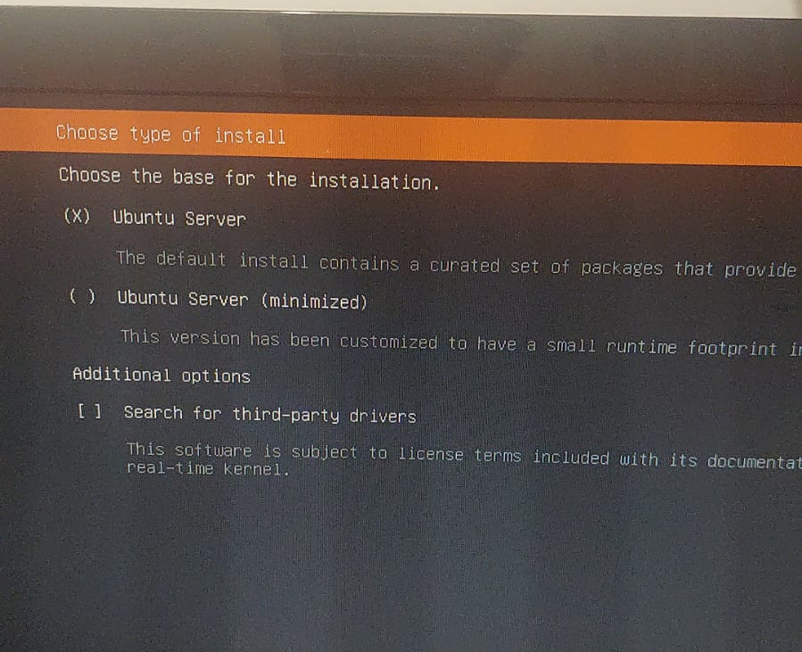

#### In case it will be installed side-by-side with windows, what I did was I installed LinuxMint (or any distro with UI), make the partitioning during the installation, then re-installed Ubuntu Server on top of the created LinuxMint partitions. I had to make that as I could not have more than 4 logical partitions (1 for boot, 1 Windows, 1 system restore, 1 Ubuntu ext4). By that, Swap was not doable

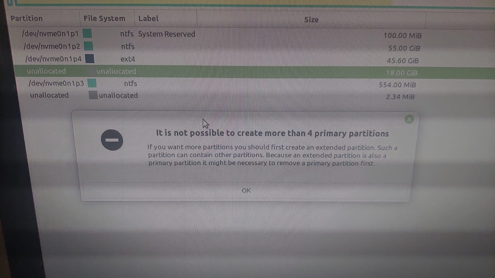

## Fix GRUB to have the dual boot

#### This step is only needed if the Mini-PC came with a pre-installed Windows, and need to keep this original installation along-side Ubuntu Server (just like my case_

_There might be a simnplar way, but I am not aware of. The below steps are what I have personally done and worked fine for me_

- Download any copy of Ubunut or LinuxMint with a UI
- Copy it to a USB and make it bootable
- Boot into this image, I used LinuxMint 21

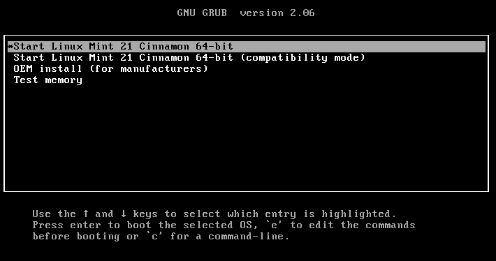

- Once it is loaded, in the application menu, search for _grub_ and then choose the _Boot Repair_

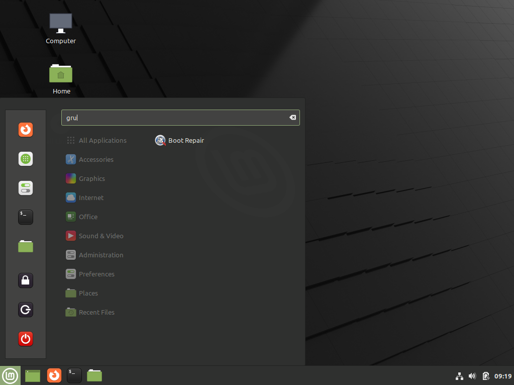

- Then wait till it loads, and select the first option _'Recommended repair'_

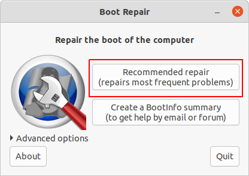

- Last step is to make sure that you have selected 'Reinstall GRUB' before clicking 'Apply'

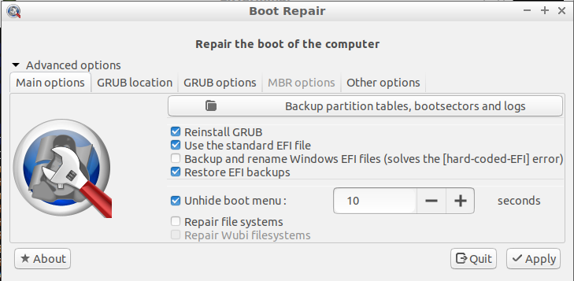

Restart the Mini-PC and make sure that the boot menu has dual boot, and try both Windows and Ubuntu Server before proceeding further. If not, [refer this site](https://sourceforge.net/p/boot-repair/home/Home/) for _boot-repair_ usage.


## Setting up internet connection

Once the installation is successful, the mini-pc will reboot into terminal mode. enter the username and password chosen during installation.

Type in:
`sudo apt install net-tools`

then

`ifconfig` and take note of the ethernet adapter name. Mine was *enp0s31f6*

Now, we need to define the network parameters

Type in
`ls /etc/netplan/` and take note of the output file there. Mine was `50-cloud-init.yaml`

Now, we need to edit this file and provide the network details, and assign a static ip for the mini-pc

In my case, I have to type
`sudoedit /etc/netplan/50-cloud-init.yaml`

A screen will open with some commented values, at the end of that file, enter the following:


```
network:
    ethernets:
        enp0s31f6: #the network interface name
            renderer: networkd
            addresses:
              - 192.168.1.5/24 #static IP of the mini-pc
            routes:
             - to: default
               via: 192.168.1.1 #gateway, usually the home network router IP
            nameservers:
              addresses: [8.8.8.8] #if you have adguard or pi-hole installed, include the IP first and seperate with a comma
```
Press _ctrl+X_, then type in _y_ and press _enter_

Now reboot the mini-pc and connect it to an ethernet cable and make sure all is working before moving to the next steps in headless mode

type in `sudo poweroff`

## Headless operation

#### Proceed with this step only when the internet is working on the mini-pc. Make sure by connecting an ethernet cable, a screen and reboot. then login and in terminal, type `ping 8.8.8.8`, if it is successfully connected, you should see reponses like in below. Otherwise, refer to the [official documentation](https://ubuntu.com/server/docs/network-configuration) and see which one suits you

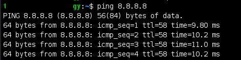

Now, when all is successful, you can move the mini-pc and install it in your server rack, and remove the monitor and keyboard. Boot it up and wait few minutes then use any terminal applciation to SSH into it.

### Use [Snowflake](https://github.com/subhra74/snowflake) as it is a cross-platform free SSH tool, for both Windows and Linux

Once installed, it is straight forward to SSH into the mini-pc, it will look like this

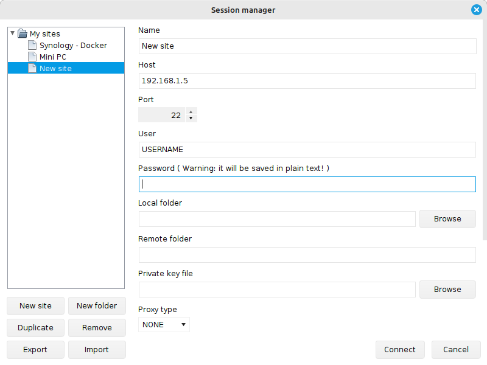

All the next steps will be done throguh this terminal, and this is called the *Headless Mode*, becuase the mini-pc is connected to the local network, and accessed remotely through a laptop, rather than connecting it to a monitor and keyboard and use it. This is what a server should look like

## Installing docker and docker-compose

Ubuntu Server comes with no docker installed. To make sure, type in `sudo docker info` and you shall get as in below. If not, then we need to update it and install docker-compose as well

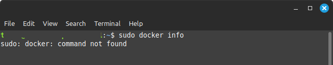

To install the docker engine, as well as the docker-compose, follow the following steps in the terminal

- Add Docker's official GPG key
```
sudo apt-get update

sudo apt-get install ca-certificates curl gnupg

sudo install -m 0755 -d /etc/apt/keyrings

curl -fsSL https://download.docker.com/linux/ubuntu/gpg | sudo gpg --dearmor -o /etc/apt/keyrings/docker.gpg

sudo chmod a+r /etc/apt/keyrings/docker.gpg
```

- Add the repository to Apt sources
```
echo "deb [arch=$(dpkg --print-architecture) signed-by=/etc/apt/keyrings/docker.gpg] https://download.docker.com/linux/ubuntu $(. /etc/os-release && echo "$VERSION_CODENAME") stable" | sudo tee /etc/apt/sources.list.d/docker.list > /dev/null

sudo apt-get update
```

- Install the latest version
`sudo apt-get install docker-ce docker-ce-cli containerd.io docker-buildx-plugin docker-compose-plugin`

- Verify the success of the installation
`sudo docker run hello-world`

If successfull, you should get something like this

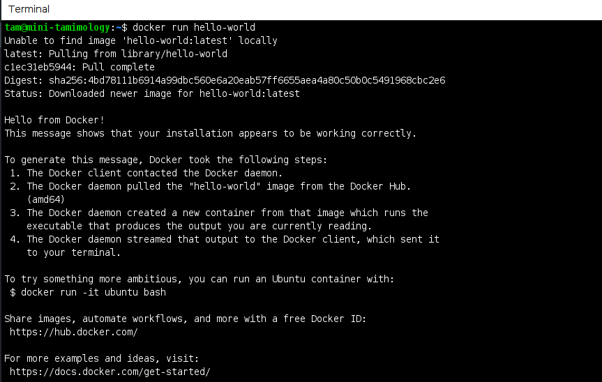

### If it was not successfull, refer this [guide](https://docs.docker.com/engine/install/ubuntu/#install-using-the-repository) and see what suits your case

- To manage Docker as a non-root user, we will create a group named _docker_ and add the current user to this group

```
sudo groupadd docker

sudo usermod -aG docker $USER
```

- Log out and log back in to re-evaluated the group membership and then activate the changes by 
`newgrp docker`

- Verify everything is successful, by running the _docker_ command without _sudo_
`docker run hello-world`

### If it was not successfull, refer this [guide](https://docs.docker.com/engine/install/linux-postinstall/) and see what suits your case


Last step is to make sure that _docekr_ is started on boot
```
sudo systemctl enable docker.service

sudo systemctl enable containerd.service
```

### To disable this, simply type in
```
sudo systemctl disable docker.service

sudo systemctl disable containerd.service
```

Verify all engines are installed and running by executing `systemctl status docker`. You should see that the engine is active and in green as below

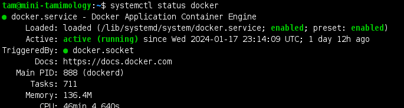


Verify the installed version is the latest one by executing `docker --version; docker-compose --version;ctr version`

### You may get a similr docker-compose version as in the one below (personally I faced this issue). In this case, you need to manually update the _docker-compose_ by following the below steps
```
Docker version 24.0.7, build afdd53b
Docker Compose version v1.29.2, build unknown
Client:
Version: 1.6.27
Revision: a1496014c916f9e62104b33d1bb5bd03b0858e59
Go version: go1.20.13
ctr: failed to dial "/run/containerd/containerd.sock": connection error: desc = "transport: error while dialing: dial unix /run/containerd/containerd.sock: connect: permission denied"
```

- Backup the current version on the host machine
`sudo mv /usr/local/bin/docker-compose /usr/local/bin/docker-compose-backup`

- Download the latest _docker-compose_, which was v2.24.0 at the time when writing this document
`sudo curl -L https://github.com/docker/compose/releases/latest/download/docker-compose-$(uname -s)-$(uname -m) -o /usr/local/bin/docker-compose`

- Make it executable
`sudo chmod +x /usr/local/bin/docker-compose`

- Verify the version is updated, and it should be => 2.24.0
`docker-compose --version`

## Mounting folders on Synology Mini-PC and Laptop

In this step, we will mount the old docker folder from Synology into the new Mini-PC drive.

First, we need to create a mapping folder on the mini-pc. If this folder is on the partition as the Ubuntu Server, then start from step #5

1. Map the other drive (my case, I have 128gb nvme for the OS, and 500gb SATA for the docker configuration files and volume mounting). So I need to auto mount the 500gb partition exceute `lsblk -o NAME,FSTYPE,UUID,MOUNTPOINTS` and take note of the partition UUID, mine is in red below
#### if the partitons are confudsing and want to have the partition size with the name and then look it in the above results, execute `sudo fdisk -l`


### Make sure that this partition is formatted as ext4, NTFS will have a lot of issues when used with docker volume mounting
 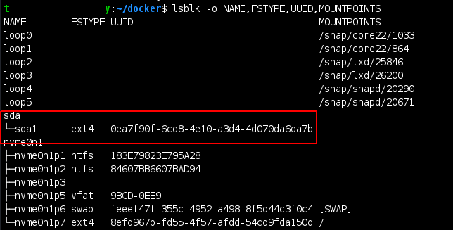

2. Make a folder to mount the this partition at, by exceuting `mkdir /home/USER/docker`

3. Add this partition to the _fstab_ to have it auto mounted at every boot by excecuting `sudoedit /etc/fstab`, and adding the follwoing line at the end of the file
`UUID=0ea7f90f-6cd8-4e10-a3d4-4d070da6da7b    /home/USER/docker   ext4    rw,relatime,discard   0    2`
#### again, press _Ctrl+X_, then _y_ and press enter to save and exit

### This makes sure that my other drive (500gb), is always accessible from the _docker_ folder under my home

4. Reload the changes, and apply them by
```
sudo systemctl daemon-reload

sudo findmnt --verify

sudo mount -a
```

5. Make a folder to mount the Synology docker folder to, by exceuting `mkdir /home/USER/syno-docker`
### Assuming that in Synology (IP 192.168.1.4), the docker files are saved at _/volume1/docker_, then edit fstab and add the below to the end of the file. Just change the *ADMIN* and *PASSWORD*

`//192.168.1.4/syno-docker    /home/USER/syno-docker cifs    username=ADMIN,password=PASSWORD,uid=1000,gid=1000    0       0`

6. Reload the changes, and apply them by
```
sudo systemctl daemon-reload

sudo findmnt --verify

sudo mount -a
```

## Copying configuaration files from Synology

After mapping the folders, we are now ready to copy the docker configuration files to the mini-pc by `cp -r /home/USER/syno-docker/ /home/USER/syno-docker/`

Last step is to change the ownership and mode of this folder to make is accessible by the _docker_ group and avoid issues when loading the contaienrs. Simply execute
```
sudo chown -R USER:docker /home/USER/syno-docker/

sudo chmod -R 777 /home/USER/syno-docker/
```

#### Another and easier way is to install a file manager on the mini-pc in docker. I used [Cloud Commander](https://github.com/coderaiser/cloudcmd)


## Migrating docker containers environments

Before creating the docker containers, just make sure that all environmental variables are modified to mini-pc variables. In my case, I had to edit the _.env_ file and modify the following
- LOCAL_TIME
- LOCAL_HOST
- PUID
- PGID
- DOCKER_SOCKET
- MEDIA_PATH
- PERSIST
- DOWNLOADS
- BACKUPS

Now, everything is ready, just execute `docker-compose up -d` and all contaienrs will be loaded.
#### Personally, I prefer to load them one at a time and mnake sure is working with no errors.


## Adding a bit of security to the Mini-PC

The final 2 steps come into hand, which are:
1. Having more powerful password

  Simply type in `sudo passwd USERNAME`, where _USERNAME_ is the current user logged in

2. Changing SSH port
 ###### [ref](https://askubuntu.com/questions/1479500/how-to-change-the-ssh-port-on-ubuntu-23-04)

  We need to edit the sock file that defines the SSH port. To do so, type in `sudoedit /lib/systemd/system/ssh.socket` and add `ListenStream=1122` to the end of the file (_SSH IP will be 1122 in this example_). Make sure it is not there originally. If so, just change the port from 22 to the desired port. Press _Ctrl+X_, then _y_ and press enter to save and exit.
  Next we need to update and apply the changes made by
  ```
  sudo systemctl daemon-reload
  sudo systemctl restart ssh
  ```

  To make sure that the new port was successfully assigned and updated, just execute `sudo lsof -i -P -n | grep LISTEN | grep ssh`. You should see the new port in place of the _22_ (in the photo, I did not change the port for illustration only)

  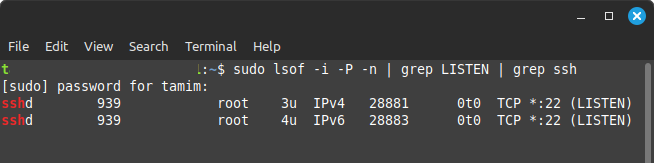


  Lastly, log off and SSH again with the new assigned port


## Easy Access the docker-compose file

This step is a bonus and only applicable if you are a Linux user (_for Windows users, you need to search for the solution, which i guess it is called Folder Mapping via Explorer_), which I personally prefer to have it, as I like to have access for everything from my laptop in headless mode. In this step, I will mount a folder on my laptop that has all the docker mounting and docker-compose file on the Mini-PC. By that, I can just edit the compose file, as well as create new folders for new containers using my LinuxMint UI installed on the laptop, instead of doing that throguh the terminal on my Mini-PC (easier)

To do so, we need to use the NFS moutning option, as this is used to mount linux-to-linux folders.

### On the server (Mini-PC)
- Install NFS
```
sudo apt update
sudo apt install nfs-kernel-server
```
- Edit the exports file to define the domain and IP to access the server
`sudoedit /etc/exports`

- Add the below line at the end of the file, assuming the mount folder on the Mini-PC are located at _/home/USER/docker_, and the Laptop IP is static at 192.168.1.100
`/home/USER/docker 192.168.1.100(rw,sync,no_subtree_check)`
#### press _Ctrl+X_, then _y_ and press enter to save and exit

- Reload the changes, and apply them by `sudo systemctl restart nfs-kernel-server`

### On the client (Laptop)
- Install NFS
```
sudo apt update
sudo apt install nfs-common
```

- Make the mapping folder by `mkdir /home/USER/minipc-docker`


- Check that both are able to see and commnicate with each other, execute `sudo showmount -e 192.168.1.5` and you shall see something like this

```
Export list for 192.168.1.5:
/home/USER/docker 192.168.1.100
```

- Verify the folder can be mounted by executing `sudo mount -t nfs 192.168.1.5:/home/USER/minipc-docker /home/USER/docker`

- If the folder was mounted successfuly, make the mounting automatically on boot by adding it to the fstab by `sudoedit /etc/fstab` and add the following line at the end of the file
`192.168.1.5:/home/USER/docker  /home/USER/minipc-docker	nfs     defaults        0 0`
#### press _Ctrl+X_, then _y_ and press enter to save and exit

- Reload the changes, and have them ready to be auto-applied on the next boot
```
sudo systemctl daemon-reload

sudo findmnt --verify
```


## My RAM usage is Leaking

After I finished setting up everything and started using it as my main server host, I noticed that the RAM usage starts at ~25% on boot time, and then keeps on increasing till it reaches ~95% and stays there. Then, swap is used!!!!

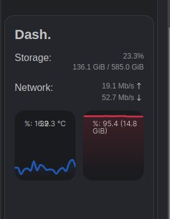


You can simply check the usage by executing the command `free -m`


Tried to troubleshoot what is going on, find the leak, is it from the system setup, swap allocation, hawrdware or even the docker containers. None was the answer, specially that the maximum docker usage for a container did not exceed 2.5%

I came to the fact that it is a kernel issue, as in version 6.5, the kernel starts to leak RAM usage to the maximum. So I need to downgrade to an earlier version.

To check your kernel version, simply execute `uname -r`

Now, how to downgrade it? Simply follow those steps:
- First, we need to download a bash tool that fetches for the kernel versions available and then automatically downloads the desired kernel version
#### for me I downloaded this tool under the _docker_ folder I have created

`wget https://raw.githubusercontent.com/pimlie/ubuntu-mainline-kernel.sh/master/ubuntu-mainline-kernel.sh`

- Then make this tool executable
`chmod +x ubuntu-mainline-kernel.sh`

- Search for the availabe kerne version available
#### for me, I have chosen v 5.15

`./ubuntu-mainline-kernel.sh -r | grep 5.15`

- Based on the results, choos the built number and download it (this time it must be in sudo mode for installation)
#### for me, I have chosen 90

`sudo ./ubuntu-mainline-kernel.sh -i v5.15.90`

- Check what are the entries avaialbe in the GRUB Bootloader, as this will be used to edit the default kernel on boot
`grep 'menuentry \|submenu ' /boot/grub/grub.cfg | cut -f2 -d "'"`

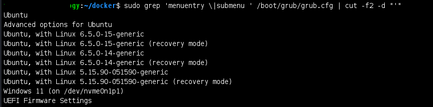

- Edit the grub menu to boot to the installed kernel
`sudoedit /etc/default/grub`

- Now replace _`GRUB_DEFAULT=0`_ to _`GRUB_DEFAULT="Advanced options for Ubuntu>Ubuntu, with Linux 5.15.90-051590-generic"`_
#### press _Ctrl+X_, then _y_ and press enter to save and exit

- Update GRUB by `sudo update-grub`

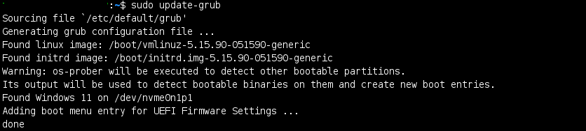

- Reboot the host `sudo reboot now`

- Once booted up, check that you have done all the steps correctly by verifying the kernel by `uname -r` and the RAM usage by `free -m`

After you have successfully downgraded the kernel, check the RAM usage and it should be stabilsed somehwere between 25% and 28%
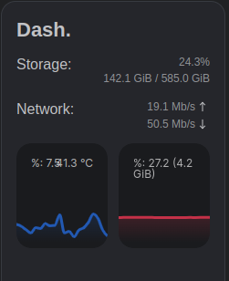


Last thing is to remove the previously installed kernel v6.5.0

- Take note of the installed kernels when executing `dpkg --list | grep linux-image`
#### for me, they were 6.5.0-14, 6.5.0-15 and 6.5.0-9

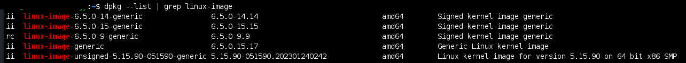

- Uninstall the kernels by executing the below command, and this will remove all three for me as they are all v6.5.0 but differnet builts

```
sudo apt remove linux-headers-6.5.0*
sudo apt remove linux-image-6.5.0*
sudo apt remove linux-modules-6.5.0*
```

- Last step is re-edit the GRUB menu and make it boot the installed kernel, regadless of the version, so that if the kernel was updated to a later built, it boots automatically
`sudoedit /etc/default/grub`

- Now replace _`GRUB_DEFAULT="Advanced options for Ubuntu>Ubuntu, with Linux 5.15.90-051590-generic"`_ back to _`GRUB_DEFAULT=0`_
#### press _Ctrl+X_, then _y_ and press enter to save and exit

- Reboot the host `sudo reboot now` and once booted, re-check that you are still on the desired kernel by `uname -r` as well as the RAM usage by `free -m`

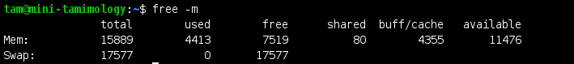
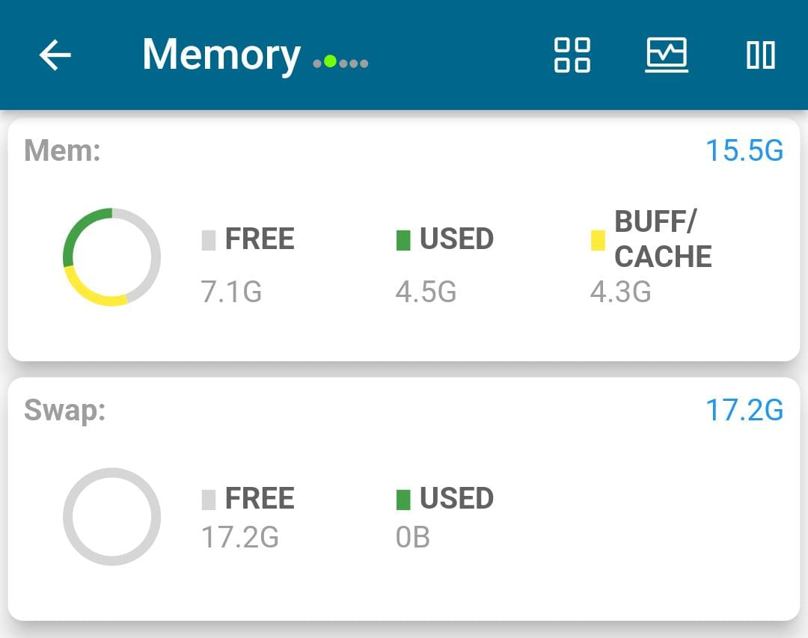


## License
This document guide is licensed under the CC0 1.0 Universal license. The terms of the license are detailed in [LICENSE](/LICENSE)
